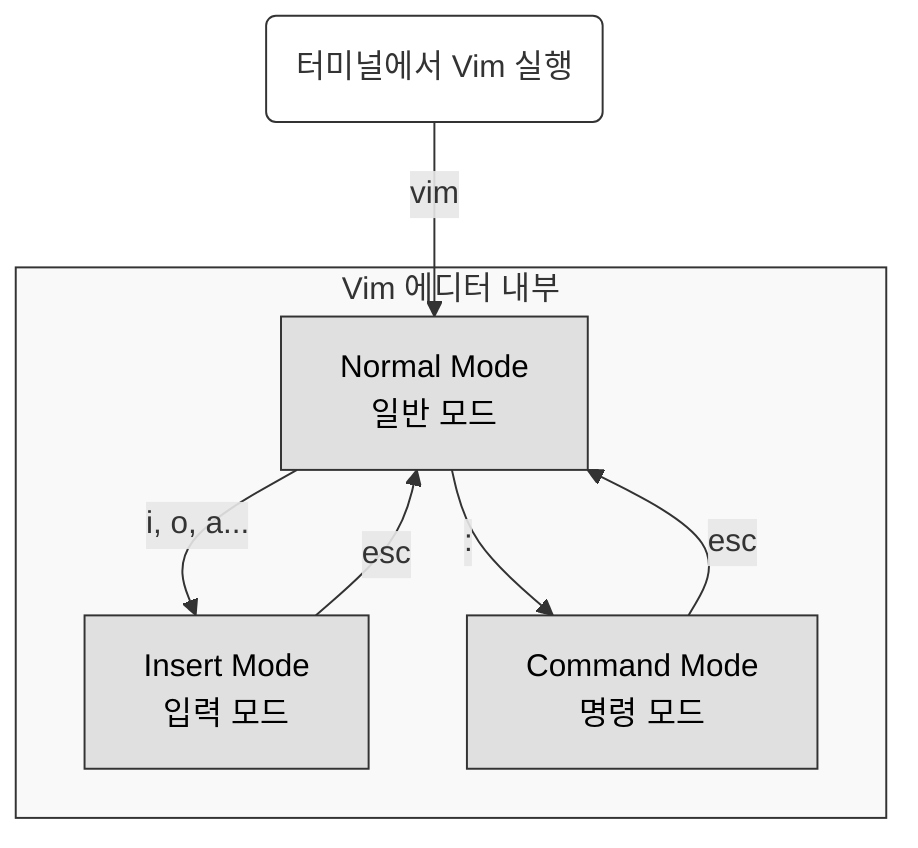

# Vim

## Vim Modes

## Normal Mode (일반 모드)
- 처음 실행하면 일반 모드로 시작
- 방향키, Home, End 등의 키를 통해 커서 이동 가능

- 커서 이동
  - `h` : 왼쪽으로 이동
  - `j` : 아래로 이동
  - `k` : 위로 이동
  - `l` : 오른쪽으로 이동
    
  - `0` : 현재 **행의 처음**으로 이동
  - `$` : 현재 **행의 끝**으로 이동
    
  - `gg` : **첫 행**으로 이동
  - `G` : **마지막 행**으로 이동
    
- 삭제 / 복사 / 붙여넣기
  - `x` : 현재 커서 위치의 **글자 삭제** (Delete)
  - `X` : 현재 커서 **앞 글자 삭제** (Backspace)
    
  - `dd` : 현재 커서가 위치한 **행 삭제**
  - `yy` : 현재 커서가 위치한 **행 복사**
    
  - `p` : 복사/삭제한 내용을 **현재 행 이후에 붙여넣기**
  - `P` : 복사/삭제한 내용을 **현재 행 이전에 붙여넣기**
 
- 문자열 찾기
  - `/문자열` + `Enter` : 현재 커서 **이후에서 문자열 검색**
  - `n` : 다음 검색 결과로 이동
    
- 되돌리기
  - `u` : **이전 수정 사항 되돌리기**

## Insert Mode (입력 모드)
- 실제로 텍스트를 입력하고 편집하는 작업을 수행
- 입력 모드 명령 키
  - `i` : 현재 커서 **위치에서 입력**
  - `I` : 현재 커서가 위치한 **행의 처음에서 입력**
  - `a` : 현재 커서 **다음 칸에서 입력**
  - `A` : 현재 커서가 위치한 **행의 마지막에서 입력**
  - `o` : 현재 커서 **다음 줄에 새 줄을 만들고 입력**
  - `O` : 현재 커서 **이전 줄에 새 줄을 만들고 입력**
  - `s` : 현재 커서의 **한 글자를 지우고 입력**
  - `S` : 현재 커서가 위치한 **한 줄 전체를 지우고 입력**

 ## Command Mode (명령 모드)
 - 저장, 종료, 취소 드의 명령을 수행
 - 명령 모드 명령어
   - `:w` : 저장
   - `:q` : 종료
   - `:i` : 취소
   - `:wq` : 저장하고 종료
   - `:q!`: 저장하지 않고 종료
   - `:%s/문자열1/문자열2/g` : 전체에서 문자열1을 모두 찾아 문자열2로 치
