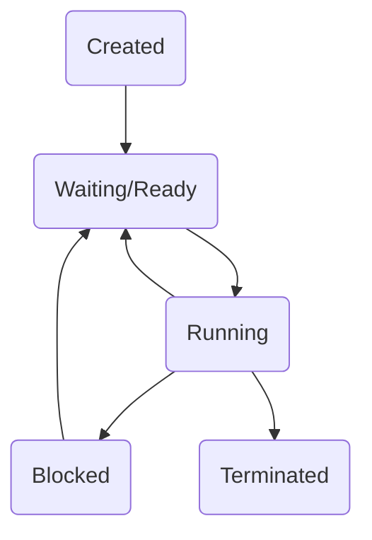
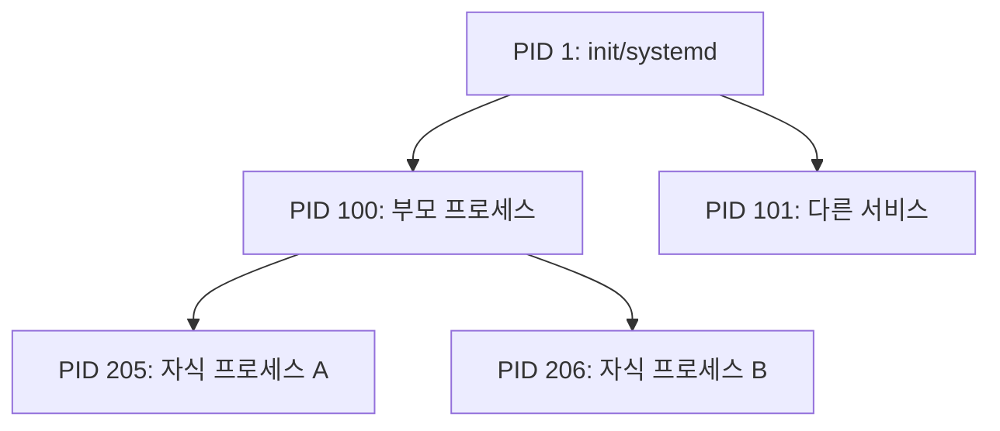

# Process

## Process
- 프로그램 : 디스크(HDD/SSD)에 저장된 실행 파일
- 프로세스 : 실행되고 있는 프로그램
  - CPU에서 실행됨
  - 여러 프로세스가 동시에 실행되는 경우, 운영체제가 CPU 실행 순서를 조절 (스케줄링) 
- 프로그램 -> 프로세스
  - 메모리 할당 : 운영체제는 실행된 프로그램을 위해 RAM에 공간 할당

### 프로세스 상태
기본적으로 5가지 상태를 가짐

- **생성 (Create)**
  - 프로세스가 생성되는 중인 상태
  - 실행을 위한 준비 단계
- **준비 (Ready)**
  - CPU를 할당받기 위해 대기 중인 상태
  - 실행 가능하지만 아직 CPU를 점유하지 않음
- **실행 (Running)**
  - 프로세스가 CPU를 점유하여 실제로 명령어를 실행 중인 상태
- **대기 (Blocked)**
  - 입출력(I/O) 대기, 자원 접근 불가 등의 이유로 작업을 수행할 수 없어 CPU를 양도하고 선수 작업이 완료되기를 대기하는 상태
- **종료 (Terminated)**
  - 실행이 완료되어 프로세스가 자원을 반납하고 사라지는 단계

### 리눅스 프로세스

- **PID**(Process ID) : 현재 프로세스의 아이디 (고유 번호)
  - 실행 중인 모든 프로세스는 서로 다른 PID를 가짐
-  **PPID**(Parent Process ID) : 부모 프로세스의 아이디
```scss
부모 프로세스(PID = X)
 └─ 자식 프로세스(PID = Y, PPID = X)
```
- 프로세스의 생성 메커니즘
  - `fork()` : 현재 실행 중인 프로세스를 그대로 복제 (원본이 부모 프로세스, 새로 생성된 프로세스가 자식)
  - `exec()` : 복제된 자식 프로세스 위헤 새로운 프로그램 코드를 덮어씌워 실행
  - 실행 흐름
    ```scss
    부모 프로세스
     ↓ fork()
    자식 프로세스 (부모와 동일)
     ↓ exec()
    다른 프로그램 실행
    ```
- **부모 프로세스의 책임**
  - 자식 프로세스의 종료 상태를 확인하고, 자식이 사용한 자원을 정리해야 함
- 특수한 상태의 프로세스
  - **고아 프로세스** (Orphan Process)
    - 부모 프로세스가 자식 프로세스보다 먼저 종료됨
    - 부모 프로세스를 init으로 변경 (PPID = 1)
      - Init 프로세스 = 모든 프로세스 계층의 최상위 부모 (PID = 1)
  - **좀비 프로세스** (Zombie Process)
    - 자식은 종료되었으나 부모가 자식의 종료 상태를 확인하지 않아 자원이 남아있는 상태
    - 부모가 wait() 등을 호출하면 제거됨 

### 프로세스 관리
- `ps [옵션]` (process state) : 현재 실행중인 프로세스의 상태를 보여줌 
